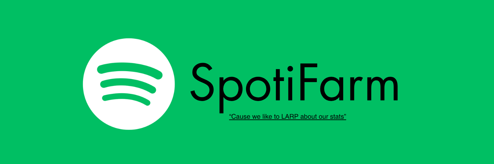

<div align="center">
  

  # SpotiFarm
  **Cause we like to LARP about our stats**

  [](#)
  [](#)
  [](#)
  [](#)
</div>

---

## The Pitch (The Yap)

Let's be completely honest for a second. December rolls around, Spotify Wrapped drops, and your group chat turns into a bloodbath of who listened to more obscure midwest emo, who managed to clock 200,000 minutes on a niche Japanese shoegaze band, or who can unironically claim they are in the top 0.001% of listeners for an underground soundcloud rapper.

Real life gets in the way of those numbers. You have to sleep, you have to talk to people, you take off your headphones. Your stats suffer, and suddenly your Wrapped looks normal. Average. Unimpressive.

**SpotiFarm exists so you can comfortably LARP as a musical hyper-connoisseur.**

Whether you want to inflate your total yearly streaming minutes, push your favorite indie artists up the algorithmic charts, farm play counts for specific tracks, or just make your stats look absurd when your friends look at your profile, SpotiFarm runs an autonomous, headless Spotify instance inside an isolated Docker container 24 hours a day, 7 days a week, 365 days a year.

It never sleeps, it never stops, and it silently pumps numbers into your account without hogging your actual speakers or sound cards.

---

## What is SpotiFarm?

SpotiFarm is a fully containerized, autonomous Spotify streaming node built around a headless Chromium instance running inside Docker.

Unlike simple API bots or deprecated librespot setups (which require Premium and break constantly with Spotify auth updates), SpotiFarm operates directly on the official **Spotify Web Player**. This ensures 100% compatibility with both **Free** and **Premium** Spotify accounts, handles ad streams automatically, and registers officially with Spotify Connect as an active computer session.

It also comes equipped with **Smart Connect awareness**: whenever you start listening to music on your actual phone, laptop, or desktop, SpotiFarm notices immediately and yields playback. The moment you stop listening on your other devices, SpotiFarm reclaims the stream and goes right back to farming.

---

## System Architecture

```
                                  ┌───────────────────────────────┐
                                  │      Host / Server Node       │
                                  └───────────────┬───────────────┘
                                                  │
                                                  ▼
┌──────────────────────────────────────────────────────────────────────────────────────────────────┐
│ Docker Container: spotifarm                                                                      │
│                                                                                                  │
│  ┌───────────────────────┐   ┌───────────────────────┐   ┌────────────────────────────────────┐  │
│  │ Xvfb (Virtual Display)│   │ PulseAudio (Null Sink)│   │ Supervisord (PID 1 Process Manager)│  │
│  │ Display :99           │   │ Audio -> /dev/null    │   │ Auto-restarts dead subprocesses    │  │
│  └───────────┬───────────┘   └───────────┬───────────┘   └─────────────────┬──────────────────┘  │
│              │                           │                                 │                     │
│              └───────────────────────────┼─────────────────────────────────┘                     │
│                                          ▼                                                       │
│                           ┌─────────────────────────────┐                                        │
│                           │ Chromium (Playwright Engine)│                                        │
│                           │ Spotify Web Player Client   │                                        │
│                           └──────────────┬──────────────┘                                        │
│                                          │                                                       │
│                      ┌───────────────────┴───────────────────┐                                   │
│                      ▼                                       ▼                                   │
│       ┌──────────────────────────────┐        ┌──────────────────────────────┐                   │
│       │ SpotiFarms Player & Watchdog │        │ WebUI Dashboard Server       │                   │
│       │ • Smart Connect auto-takeover│        │ • Native Node.js HTTP Server │                   │
│       │ • Organic skips & rotations  │        │ • Real-time status / controls│                   │
│       └──────────────┬───────────────┘        └──────────────┬───────────────┘                   │
└──────────────────────┼───────────────────────────────────────┼───────────────────────────────────┘
                       │                                       │
                       ▼                                       ▼
            ┌─────────────────────┐                 ┌─────────────────────┐
            │ noVNC Web UI (:6080)│                 │ WebUI Portal (:3000)│
            │ First-time login    │                 │ Live management     │
            └─────────────────────┘                 └─────────────────────┘
```

### Core Tech Stack

* **Runtime:** Node.js 20 LTS
* **Browser Automation:** Playwright with hardened Chromium (anti-fingerprinting, automation flags stripped)
* **Virtual Display:** Xvfb (X Virtual FrameBuffer) running on `:99`
* **Virtual Audio Sink:** PulseAudio configured with a virtual null sink (audio renders to memory and discards cleanly without needing a hardware sound card)
* **Process Management:** Supervisord handling graceful subprocess lifecycle and crash recovery
* **Interactive Access:** x11vnc + noVNC for browser-based remote desktop authentication
* **Web UI & REST API:** Native zero-dependency HTTP server with a glassmorphic dashboard

---

## Key Features

### 1. Smart Spotify Connect Awareness (Yield & Auto-Takeover)
SpotiFarm actively monitors Spotify Connect state directly from the DOM:
* **Yielding Mode:** When you start listening on your phone or PC, SpotiFarm detects the active external device, halts playlist rotations, pauses auto-skips, and remains completely silent.
* **Auto-Takeover:** When you finish listening and pause your music, SpotiFarm waits a configurable grace period (e.g. 10 seconds) and automatically takes over playback on the Docker instance.
* **Non-Destructive Playback:** If you manually change a track or album, SpotiFarm recognizes user intent and will not force-reset your queue back to the default farm playlist.

### 2. Glassmorphic Web Dashboard (`:3000`)
A real-time management dashboard featuring:
* **Account Info:** Displays your active Spotify display name and profile picture pulled directly from Spotify CDN.
* **Live Now Playing Card:** High-resolution album artwork, track title, artist name, active playlist badge, real-time progress bar, and animated equalizer visualizer.
* **Direct URL Player:** Paste any Spotify track, album, artist, or playlist URL into the top search bar to play it instantly.
* **Interactive Playlist Tracklist:** View up to 30 visible tracks from the currently loaded playlist; click any track in the WebUI to jump directly to it.
* **Full Transport Controls:** Play, Pause, Previous Track, Next Track, and Force Takeover buttons.

### 3. Humanized Farming Algorithms
To avoid looking like a static bot:
* **Randomized Skips:** Configurable ceiling of humanized track skips per hour (default: 8 skips/hr) with randomized intervals.
* **Playlist Rotation:** Automatically rotates between an array of target playlists on a custom schedule (e.g. every 60 minutes).
* **Auto-Shuffle:** Keeps Spotify's shuffle mode enabled across rotations.

### 4. Zero-Maintenance Reboot Resilience
* Powered by Docker volume persistence (`chrome-profile:/data/chrome-profile`).
* Login once upon installation. Even if your physical server loses power, crashes, or reboots, Docker starts the container back up and SpotiFarm resumes streaming within 15 seconds without prompting for login again.

---

## Step-by-Step Deployment Guide

### Prerequisites
* Docker Engine 20.10+
* Docker Compose v2+
* Git

---

### 1. Clone the Repository

```bash
git clone https://github.com/ELAVL-BAT/SpotiFarm.git
cd SpotiFarm
```

### 2. Launch SpotiFarm with Docker Compose

```bash
docker compose up -d
```

Docker will build the image with all virtual display and audio drivers, mount the persistent profile volume, and start the services in the background.

---

### 3. Complete First-Time Spotify Login (One-Time Only)

Because Spotify uses modern authentication and CAPTCHA safeguards, you perform a 1-minute login through the built-in browser viewer:

1. Open your browser and navigate to:
   ```
   http://localhost:6080/vnc.html
   ```
   *(Replace `localhost` with your VPS IP address if running on a remote server).*

2. Click **Connect** to open the virtual desktop view showing the Spotify Web Player.
3. Log in with your Spotify credentials (Email/Password, Google, Facebook, or Apple login).
4. Once you reach the main Spotify Web Player home screen, you can close the VNC tab.

> **Note:** All session cookies and tokens are permanently saved to the Docker volume. You will never need to log in again on future container restarts or system reboots.

---

### 4. Access the Web Dashboard

Open the SpotiFarm Web Dashboard in your browser:
```
http://localhost:3000
```

From the dashboard, you can:
* Monitor your current track and stream status in real-time.
* Configure your farm playlists and albums.
* Adjust takeover timers and skip limits.
* Paste any track or playlist URL to play on demand.

---

## Configuration Reference

You can edit settings directly from the WebUI settings panel or by modifying [`config/config.json`](config/config.json):

```json
{
  "playlists": [
    "https://open.spotify.com/playlist/37i9dQZF1DXcBWIGoYBM5M",
    "https://open.spotify.com/playlist/37i9dQZF1DX0XUsuxWHRQd"
  ],
  "autoPlay": true,
  "autoTakeover": true,
  "shuffle": true,
  "watchdogIntervalMs": 15000,
  "takeoverDelayMs": 10000,
  "playlistRotateMinutes": 60,
  "maxSkipsPerHour": 8,
  "vnc": true
}
```

### Options Breakdown

| Parameter | Type | Default | Description |
|---|---|---|---|
| `playlists` | Array | `[...]` | List of Spotify playlist or album URLs to rotate through |
| `autoPlay` | Boolean | `true` | Enables continuous 24/7 playback |
| `autoTakeover` | Boolean | `true` | Reclaims playback on Docker once external devices go idle |
| `takeoverDelayMs` | Integer | `10000` | Grace period (in milliseconds) before reclaiming playback |
| `shuffle` | Boolean | `true` | Automatically toggles shuffle mode on playlist change |
| `watchdogIntervalMs` | Integer | `15000` | Health check and connect state scan interval |
| `playlistRotateMinutes`| Integer | `60` | Time in minutes before rotating to the next playlist in the array |
| `maxSkipsPerHour` | Integer | `8` | Maximum humanized random track skips allowed per hour |

---

## Exposed Ports

| Port | Service | Purpose |
|---|---|---|
| `3000` | **WebUI Dashboard** | Real-time status, album art, interactive controls, and settings |
| `6080` | **noVNC Web Viewer** | HTML5 remote desktop viewer for initial Spotify authentication |
| `5900` | **Raw VNC** | Direct connection for standard VNC desktop clients (TigerVNC, RealVNC) |

---

## Managing the Container

```bash
# View live logs
docker compose logs -f spotifarm

# Restart SpotiFarm
docker compose restart spotifarm

# Stop SpotiFarm
docker compose down

# Update and rebuild after git pull
docker compose build --no-cache && docker compose up -d
```

---

## License

Distributed under the MIT License.
